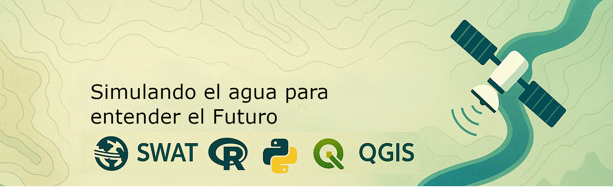

# Hi, my name is Kevin Arnold Traverso! 👋

- 👋 Hi, I’m Kevin Arnold (@arnoldtraverso)
- 🏔️ I’m a graduate **Water Resources** student at [Universidad Nacional Agraria La Molina](http://www.lamolina.edu.pe/)
- 👀 I’m interested in **Hydrology and geoscience**
- 🌱 I’m currently learning research in **Hydrological Models**
- 🤓 I’m looking to collaborate on **Hydrology and Water Resources** open source projects
- 📫 How to reach me: X: [@Traversoarnold](https://twitter.com/Traversoarnold)

<!---
arnoldtraverso/arnoldtraverso is a ✨ special ✨ repository because its `README.md` (this file) appears on your GitHub profile.
You can click the Preview link to take a look at your changes.
--->
